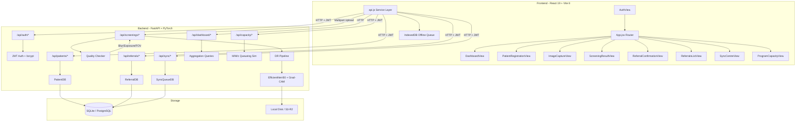
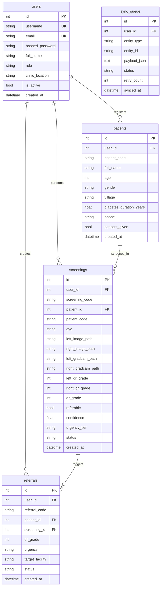

# DrishtiCare — Complete Project Reverse-Engineering Report

> **Project**: DrishtiCare — Explainable AI Diabetic Retinopathy Screening & District Telemedicine System  
> **Context**: Smart India Hackathon (SIH) 2026 · Problem Statement 26038  
> **Report Generated**: September 4, 2026

---

## 1. Executive Summary

DrishtiCare is a **full-stack AI-powered telemedicine platform** designed for rural India to screen diabetic patients for **Diabetic Retinopathy (DR)** using retinal fundus images. A health worker at a Primary Health Centre (PHC) captures fundus photos, the AI classifies the DR severity (Grade 0–4), generates **Grad-CAM explainability heatmaps**, and auto-generates referral slips for patients requiring specialist attention.

| Dimension | Detail |
|-----------|--------|
| **Problem** | 100M+ diabetics in India, <30% ever screened for DR |
| **Solution** | AI screening at rural PHCs by non-specialist health workers |
| **AI Model** | EfficientNet-B0 fine-tuned on IDRiD benchmark + authentic Grad-CAM |
| **Backend** | FastAPI + SQLAlchemy + PyTorch + OpenCV |
| **Frontend** | React 19 + Vite 8 + Tailwind CSS |
| **Database** | SQLite (dev) / PostgreSQL (prod) |
| **Offline** | IndexedDB queue with sync center |
| **Deployment** | Docker Compose, Vercel/Render/Railway |

---

## 2. What Problem Does This Project Solve?

Diabetic Retinopathy (DR) is the leading cause of preventable blindness among diabetics. In rural India:
- Ophthalmologists are concentrated in urban areas
- PHC nurses cannot diagnose DR from fundus images
- Most diabetics never get screened until vision loss occurs

DrishtiCare solves this by:
1. Allowing **any health worker** to capture fundus photos with a simple camera
2. Running **AI classification** (EfficientNet-B0) to grade DR severity 0–4
3. Generating **Grad-CAM heatmaps** showing where the AI detected lesions
4. Auto-generating **referral slips** for patients with Grade ≥ 2
5. Working **offline** in rural areas with poor connectivity
6. Providing a **capacity simulator** for district health planning

---

## 3. Technology Stack

### Backend (Python)
| Technology | Purpose |
|-----------|---------|
| FastAPI | REST API framework |
| Uvicorn | ASGI server |
| PyTorch + TorchVision | DL inference (EfficientNet-B0) |
| OpenCV | Image quality validation, preprocessing |
| SQLAlchemy | ORM for SQLite/PostgreSQL |
| Pydantic + pydantic-settings | Data validation, config management |
| bcrypt | Password hashing |
| PyJWT | JWT authentication tokens |
| boto3 | S3/R2/B2 cloud storage |
| Alembic | Database migrations |
| Pandas, NumPy, SciPy, scikit-learn | Data processing, training |

### Frontend (JavaScript)
| Technology | Purpose |
|-----------|---------|
| React 19 | UI framework |
| Vite 8 | Build tool & dev server |
| Tailwind CSS 3.4 | Utility-first CSS |
| Recharts | Dashboard charts |
| Framer Motion | Animations |
| Lucide React | Icons |
| shadcn/ui | Component system |

### Infrastructure
| Technology | Purpose |
|-----------|---------|
| Docker + Docker Compose | Containerized deployment |
| PostgreSQL 16 | Production database |
| Nginx | Frontend static serving |
| GitHub Actions CI/CD | Automated testing |
| SQLite | Development database |

---

## 4. Complete Project Structure

```
DrishtiCare/
├── backend/                          → Python FastAPI backend
│   ├── app/
│   │   ├── main.py                   → FastAPI app entry point, lifespan, router mounting
│   │   ├── config.py                 → Pydantic Settings (env-driven config)
│   │   ├── models/
│   │   │   └── schemas.py            → SQLAlchemy DB models + Pydantic schemas
│   │   ├── ml/
│   │   │   ├── dr_model.py           → EfficientNet-B0 inference + Grad-CAM pipeline
│   │   │   ├── quality.py            → OpenCV image quality gatekeeper + MobileNet OOD
│   │   │   ├── model_referable_dr.pt → Trained PyTorch weights (binary)
│   │   │   ├── train_model_real.py   → Fine-tuning script on IDRiD dataset
│   │   │   └── train_evaluate.py     → Training evaluation utilities
│   │   ├── routers/
│   │   │   ├── auth.py               → JWT auth (register, login, /me)
│   │   │   ├── patients.py           → Patient CRUD
│   │   │   ├── screenings.py         → Core: image upload → quality → AI → Grad-CAM
│   │   │   ├── referrals.py          → Referral CRUD
│   │   │   ├── dashboard.py          → Aggregated metrics
│   │   │   ├── sync.py               → Offline sync queue management
│   │   │   ├── capacity.py           → Capacity simulation endpoint
│   │   │   └── samples.py            → Pre-bundled sample images
│   │   ├── simulation/
│   │   │   └── capacity_sim.py       → M/M/c queueing model for district planning
│   │   ├── storage/
│   │   │   └── storage_manager.py    → Local disk ↔ S3/R2 abstraction
│   │   └── utils/
│   │       ├── file_validation.py    → Upload size/type guard
│   │       └── tenant.py             → Per-user data isolation helpers
│   ├── data/images/                  → Stored fundus + Grad-CAM images
│   ├── migrations/                   → Alembic DB migration scripts
│   ├── scripts/
│   │   ├── migrate_images_to_s3.py   → Local → S3 image migration
│   │   └── migrate_sqlite_to_postgres.py → SQLite → PostgreSQL migration
│   ├── tests/
│   │   ├── test_full_system.py       → Comprehensive system pytest suite
│   │   ├── test_model_sanity.py      → Model inference sanity checks
│   │   └── verify_all.py             → Standalone verification script
│   ├── .env                          → Active environment config
│   ├── .env.example                  → Documented env template
│   ├── requirements.txt              → Python dependencies
│   ├── Dockerfile                    → Backend container
│   └── alembic.ini                   → Alembic migration config
│
├── frontend/                         → React + Vite frontend
│   ├── src/
│   │   ├── main.jsx                  → React DOM mount point
│   │   ├── App.jsx                   → Root component: state, routing, navigation
│   │   ├── views/
│   │   │   ├── AuthView.jsx          → Login / Register
│   │   │   ├── DashboardView.jsx     → Metrics & charts
│   │   │   ├── PatientRegistrationView.jsx → Patient intake form
│   │   │   ├── ImageCaptureView.jsx  → Camera/upload + quality check
│   │   │   ├── ScreeningResultView.jsx → AI results + Grad-CAM display
│   │   │   ├── ReferralConfirmationView.jsx → Printable referral slip
│   │   │   ├── ReferralsListView.jsx → All referrals table
│   │   │   ├── SyncCentreView.jsx    → Offline sync management
│   │   │   ├── ProgramCapacityView.jsx → Capacity simulation UI
│   │   │   └── HelpView.jsx          → User guide & FAQ
│   │   ├── components/
│   │   │   ├── Navigation.jsx        → Sidebar navigation
│   │   │   ├── ReferralDetailModal.jsx → Referral detail popup
│   │   │   ├── ui/                   → Button, Loader, AvatarPicker, etc.
│   │   │   └── motion-primitives/    → Animation wrappers (tsx)
│   │   ├── services/
│   │   │   ├── api.js                → API client + offline interceptor
│   │   │   └── offlineDb.js          → IndexedDB wrapper
│   │   └── lib/
│   │       ├── utils.js              → cn() utility for Tailwind
│   │       └── motion.ts             → Framer motion re-exports
│   ├── package.json                  → NPM dependencies
│   ├── vite.config.js                → Vite build config
│   ├── tailwind.config.js            → Tailwind theming
│   ├── Dockerfile                    → Frontend container
│   └── nginx.conf                    → Production static serving
│
├── src/js/                           → ⚠️ Legacy standalone prototype (NOT used by React app)
│   ├── app.js                        → Vanilla JS dashboard simulator
│   ├── sampleData.js                 → Hardcoded mock patients
│   ├── imageQuality.js               → Canvas-based quality simulation
│   ├── segmentation.js               → Canvas-based segmentation simulation
│   ├── gradingGradCAM.js             → Canvas-based Grad-CAM simulation
│   ├── charts.js                     → Chart.js dashboard charts
│   ├── explainabilityReport.js       → HTML report generator
│   └── simulinkSimulator.js          → JS capacity simulation
│
├── matlab/                           → ⚠️ Standalone MATLAB proof-of-concept
│   ├── dr_grading_gradcam.m          → MATLAB DR grading + Grad-CAM
│   ├── quality_enhancement.m         → Image preprocessing
│   ├── retinal_segmentation.m        → Retinal vessel segmentation
│   └── telemedicine_simulink.m       → Simulink capacity model
│
├── Dataset/                          → Training datasets (large ZIPs)
│   ├── A. Segmentation.zip (584 MB)
│   ├── B. Disease Grading.zip (212 MB)
│   └── C. Localization.zip (212 MB)
│
├── data/drishticare.db               → SQLite database (active)
├── index.html                        → ⚠️ Root-level standalone prototype
├── docker-compose.yml                → Full-stack Docker orchestration
├── run_drishticare.py                → Unified launcher (backend + frontend)
├── start_all.bat                     → Windows launcher
├── start_server.sh                   → ⚠️ Legacy: serves root index.html
├── README.md                         → Project documentation
├── DEPLOYMENT.md                     → Cloud deployment guide
├── DISHA_COMPLIANCE.md               → Indian healthcare compliance docs
├── scripts/e2e_verify.mjs            → Playwright E2E test script
└── .github/workflows/ci.yml          → GitHub Actions CI pipeline
```

> [!IMPORTANT]
> The project contains **three codebases**:
> 1. **Actual application**: `backend/` (FastAPI + PyTorch) + `frontend/` (React + Vite) — this is the real system
> 2. **Legacy prototype**: `index.html` + `src/js/*` — standalone vanilla JS demo that *simulates* AI using Canvas drawing
> 3. **MATLAB scripts**: `matlab/*` — standalone proof-of-concept, not connected to either codebase

---

## 5. Architecture

### High-Level Architecture Diagram



### Component Communication Flow

```
User (Health Worker)
    ↓
React Frontend (localhost:5173)
    ↓ HTTP/REST + JWT Bearer Token
FastAPI Backend (localhost:8000)
    ↓
Router Layer (auth, patients, screenings, referrals, dashboard, sync, capacity)
    ↓
Service Layer (dr_pipeline, quality_checker, capacity_simulator, storage_manager)
    ↓
Data Layer (SQLAlchemy ORM → SQLite/PostgreSQL, StorageManager → Local Disk/S3)
```

---

## 6. Entry Point and Startup Flow

### Command to Start

```bash
# Option 1: Unified launcher
python run_drishticare.py

# Option 2: Windows batch file
start_all.bat

# Option 3: Manual (what run_drishticare.py does)
python -m uvicorn backend.app.main:app --host 0.0.0.0 --port 8000 --reload  # Terminal 1
cd frontend && npm run dev                                                     # Terminal 2
```

### Exact Startup Trace

```
START
 ↓
run_drishticare.py → main()
 ↓
subprocess.Popen("uvicorn backend.app.main:app")
 ↓
backend/app/main.py loads → imports config.py
 ↓
config.py → Settings(BaseSettings) reads backend/.env
 ↓
  → STORAGE_MODE=local, DATABASE_URL=sqlite:///./data/drishticare.db
  → JWT_SECRET_KEY, MODEL_WEIGHTS_PATH, quality thresholds
 ↓
main.py imports schemas.py
 ↓
schemas.py → create_engine(DATABASE_URL), SessionLocal created
 ↓
main.py imports dr_model.py
 ↓
dr_model.py → RetinalAnalysisPipeline.__init__()
 ↓
  → DRClassifier(EfficientNet-B0) created
  → model_referable_dr.pt checkpoint loaded (strict=False)
  → Forward/backward hooks registered on backbone.features[-1]
  → Model set to eval mode
 ↓
main.py imports quality.py
 ↓
quality.py → ImageQualityChecker.__init__()
 ↓
  → GatekeeperCNN(MobileNet-V2) created
  → Tries to load fundus_gatekeeper.pt (optional, may not exist)
 ↓
main.py imports storage_manager.py
 ↓
storage_manager.py → StorageManager.__init__()
 ↓
  → mode="local", creates ./data/images directory
 ↓
main.py imports all routers (auth, patients, screenings, referrals, dashboard, sync, capacity, samples)
 ↓
FastAPI app created with lifespan handler
 ↓
lifespan() runs on startup:
 ↓
  → init_db() → Base.metadata.create_all() (creates 5 tables if missing)
  → _migrate_user_scoped_columns() (adds user_id to legacy tables)
  → _purge_unscoped_clinical_data() (removes orphaned rows)
 ↓
  → Pre-warms PyTorch model with dummy 380x380 image
  → dr_pipeline.predict(dummy_img, generate_cam=True)
 ↓
CORS middleware added (allow_origins=["*"])
 ↓
Static files mounted: /static → backend/app/static, /images → data/images
 ↓
8 routers mounted under /api prefix
 ↓
Uvicorn running on http://0.0.0.0:8000
 ↓
subprocess.Popen("npm run dev", cwd=frontend/)
 ↓
Vite dev server on http://localhost:5173
 ↓
APPLICATION READY
```

---

## 7. Complete Data Flow

### Primary Use Case: Screening a Patient for Diabetic Retinopathy

```
Health Worker opens http://localhost:5173
 ↓
App.jsx mounts → fetchCurrentUser() → GET /api/auth/me
 ↓
No token → shows AuthView (login/register)
 ↓
Worker fills form → loginUser() → POST /api/auth/login
 ↓
auth.py:login_health_worker()
  → UserDB.query(username)
  → bcrypt.checkpw(password, hash)
  → create_access_token({sub: username, role: role})
  → Returns {access_token, user}
 ↓
Token saved to localStorage, App sets currentUser
 ↓
DashboardView loads → GET /api/dashboard/summary (with JWT)
  → dashboard.py aggregates today's screenings, pending referrals, 7-day trend
 ↓
Worker clicks "Start New Screening"
 ↓
PatientRegistrationView → fills name, age, gender, village, diabetes years, consent
  → registerPatient() → POST /api/patients
  → patients.py creates PatientDB(user_id=current_user.id, patient_code=PAT-U{id}-{rand})
  → Returns patient object
 ↓
App sets activePatient, navigates to ImageCaptureView
 ↓
ImageCaptureView: Worker selects "Left Eye" tab
  → Opens webcam OR chooses file upload
  → Captures image
  → checkImageQuality() → POST /api/screenings/check-quality (multipart file)
  → quality.py evaluates:
    1. GatekeeperCNN: Is this actually a fundus image? (MobileNet-V2 binary classifier)
    2. Laplacian variance > 2.0? (blur detection)
    3. 25 < mean_brightness < 220? (exposure check)
    4. FOV fraction > 10%? (retinal disc coverage)
    5. Center offset < 45%? (alignment check)
  → Returns {passed: true/false, issues: [...], recommendation: "..."}
 ↓
Worker captures right eye similarly
 ↓
Worker clicks "Run Screening"
  → uploadAndScreen() → POST /api/screenings/upload (multipart: patient_id, left_eye, right_eye)
 ↓
screenings.py:upload_and_screen() → screen_patient_image()
  → For each eye: _process_single_eye_image()
    1. Decode JPEG bytes → OpenCV BGR image
    2. Save raw image via storage_manager.save_bytes() → /images/images/{patient_id}/{code}_{eye}.jpg
    3. Quality gate: quality_checker.evaluate(img_bgr)
       → If FAIL: return grade=-1, "Ungradeable"
    4. ML inference: dr_pipeline.predict(img_bgr, generate_cam=True)
       a. preprocess_ben_graham(): CLAHE on green channel → crop retina → resize 256x256
          → Ben Graham local color norm (4*img - 4*gaussian + 128) → circular mask
       b. Transform to tensor → ImageNet normalize
       c. TTA: model(original) + model(horizontal_flip) → average logits
       d. Temperature scaling T=1.5: softmax(logits/1.5) → calibrated probabilities
       e. predicted_grade = argmax(avg_logits)
       f. Grad-CAM: fresh forward → backward(predicted_class) → hook activations/gradients
          → weights = GlobalAvgPool(gradients) → cam = ReLU(Σ weights × activations)
          → Normalize → resize to original → TURBO colormap overlay (α=0.72)
          → Find hotspot contours → return overlay + hotspot coords
    5. Save Grad-CAM overlay via storage_manager → /images/images/{patient_id}/{code}_{eye}_gradcam.jpg
 ↓
  → Determine overall grade = max(left_grade, right_grade)
  → referable = any eye grade ≥ 2
  → Create ScreeningDB row with all per-eye + aggregated fields
  → db.commit()
  → Return ScreeningResponse (38 fields including dual-eye diagnostics)
 ↓
App receives result, sets screeningResult, navigates to ScreeningResultView
 ↓
ScreeningResultView displays:
  → Left/Right eye tabs
  → Original image + Grad-CAM overlay toggle
  → Grade, confidence, urgency, clinical explanation
  → Hotspot markers on the heatmap
 ↓
If referable (grade ≥ 2): Worker clicks "Create Referral"
 ↓
ReferralConfirmationView → createReferral() → POST /api/referrals
  → referrals.py creates ReferralDB with referral_code=REF-{date}-{uuid}
  → Links patient_id + screening_id
  → Returns printable referral slip
 ↓
Worker prints slip, gives to patient
 ↓
Worker clicks "Finish" → returns to DashboardView
```

---

## 8. File-by-File Analysis

### Backend Core Files

#### [`main.py`](file:///c:/Users/lohit/Downloads/SIH/SIH/backend/app/main.py)
**Purpose**: FastAPI application factory and startup orchestrator.
- Creates FastAPI app with `lifespan` async context manager
- Mounts `/static` and `/images` as static file directories
- Registers 8 API routers under `/api` prefix
- CORS middleware with `allow_origins=["*"]`
- Pre-warms PyTorch model on startup with a dummy image
- Health check endpoint at `GET /`

#### [`config.py`](file:///c:/Users/lohit/Downloads/SIH/SIH/backend/app/config.py)
**Purpose**: Centralized environment-driven configuration using Pydantic BaseSettings.
- **Key settings**: `storage_mode` (local/cloud), `database_url`, `jwt_secret_key`, `model_weights_path`, quality thresholds
- Reads from `backend/.env` via `SettingsConfigDict`
- Exports global `settings` singleton

#### [`schemas.py`](file:///c:/Users/lohit/Downloads/SIH/SIH/backend/app/models/schemas.py)
**Purpose**: Combined SQLAlchemy ORM models and Pydantic request/response schemas.
- **5 DB tables**: `UserDB`, `PatientDB`, `ScreeningDB`, `ReferralDB`, `SyncQueueDB`
- **ScreeningDB** is the most complex table with 30+ columns for dual-eye diagnostics
- Engine creation handles both SQLite (with `check_same_thread=False`) and PostgreSQL
- `init_db()` creates tables + runs lightweight migrations
- `_migrate_user_scoped_columns()` ALTERs legacy tables to add `user_id`
- `_purge_unscoped_clinical_data()` removes orphaned rows without `user_id`

#### [`dr_model.py`](file:///c:/Users/lohit/Downloads/SIH/SIH/backend/app/ml/dr_model.py)
**Purpose**: The heart of the AI system — EfficientNet-B0 inference + authentic Grad-CAM.
- **`DRClassifier`**: EfficientNet-B0 backbone with custom 5-class head (Dropout 0.3 + Linear)
- **`RetinalAnalysisPipeline`**: Full inference engine
  - `preprocess_ben_graham()`: CLAHE → crop → resize 256 → Ben Graham normalization → circular mask
  - `predict()`: TTA (original + h-flip) → temperature scaling (T=1.5) → grade + confidence + explanation
  - `_compute_gradcam()`: Hook-based Grad-CAM on `backbone.features[-1]` (1280 channels)
    → ReLU → normalize → TURBO colormap → alpha blend (0.72) → hotspot detection
- **Singleton**: `dr_pipeline = RetinalAnalysisPipeline(checkpoint_path=DEFAULT_CHECKPOINT)`

#### [`quality.py`](file:///c:/Users/lohit/Downloads/SIH/SIH/backend/app/ml/quality.py)
**Purpose**: Two-tier image quality gatekeeper — ML + traditional CV.
- **Tier 1 (ML)**: `GatekeeperCNN` — MobileNet-V2 binary classifier for fundus vs non-fundus (OOD detection)
  - Loads `fundus_gatekeeper.pt` if present; gracefully degrades if missing
- **Tier 2 (OpenCV)**:
  - Blur detection: Laplacian variance threshold (min 2.0)
  - Exposure: mean brightness bounds (25–220)
  - FOV: retinal disc area as fraction of image (min 10%)
  - Centering: centroid offset from image center (max 45%)
- Returns structured dict with pass/fail + actionable guidance text

#### [`storage_manager.py`](file:///c:/Users/lohit/Downloads/SIH/SIH/backend/app/storage/storage_manager.py)
**Purpose**: Unified storage abstraction — identical interface for local disk and cloud S3/R2/B2.
- `save_bytes()`: Writes raw bytes to disk or S3 bucket
- `save_cv2_image()`: Encodes OpenCV image as JPEG then saves
- `get_image_bytes()`: Reads from disk or S3
- Automatic fallback: cloud errors → local disk
- Returns URL paths consumable by the frontend (`/images/...` for local, CDN URL for cloud)

#### [`auth.py`](file:///c:/Users/lohit/Downloads/SIH/SIH/backend/app/routers/auth.py)
**Purpose**: JWT-based authentication for health workers.
- `hash_password()`: bcrypt with auto-generated salt
- `verify_password()`: bcrypt checkpw
- `create_access_token()`: PyJWT encode with 8-hour expiry (clinical shift length)
- `require_auth()`: FastAPI dependency — extracts JWT from Bearer header, decodes, fetches user from DB
- Endpoints: `POST /register`, `POST /login`, `GET /me`

#### [`screenings.py`](file:///c:/Users/lohit/Downloads/SIH/SIH/backend/app/routers/screenings.py)
**Purpose**: Core screening workflow — the most complex router.
- `POST /check-quality`: Standalone quality validation for live feedback
- `POST /{patient_id}/image`: Dual-eye screening pipeline (quality → AI → Grad-CAM → DB)
- `POST /upload`: Alternate upload endpoint (delegates to above)
- `POST /process-sample`: Runs AI on pre-bundled IDRiD/APTOS samples
- `GET /`, `GET /{id}`: List/retrieve screenings
- `_process_single_eye_image()`: Per-eye helper (save → quality gate → ML inference → Grad-CAM save)
- Overall grade = max severity between eyes; referral = any eye ≥ 2

#### [`capacity_sim.py`](file:///c:/Users/lohit/Downloads/SIH/SIH/backend/app/simulation/capacity_sim.py)
**Purpose**: Discrete-event queueing simulation for district health planning.
- Models 4 stages: Capture → Upload → AI Inference → Human Review
- Uses M/M/c queueing theory with configurable parameters
- Network bandwidth presets: 2G (45s), 3G (12s), 4G_Rural (3.5s), Fiber (0.8s)
- Generates: hourly queue trajectory, utilization gauges, bottleneck identification, recommendations
- Target: 100,000+ screenings/year

#### [`tenant.py`](file:///c:/Users/lohit/Downloads/SIH/SIH/backend/app/utils/tenant.py)
**Purpose**: Per-user data isolation helpers.
- `get_user_patient()`, `get_user_screening()`, `get_user_referral()`
- All queries filter by both entity ID and `user_id` to prevent cross-user data access

#### [`file_validation.py`](file:///c:/Users/lohit/Downloads/SIH/SIH/backend/app/utils/file_validation.py)
**Purpose**: Upload security guard.
- Validates content type (JPEG/PNG only) and file extension
- Enforces 15 MB max upload size
- Returns raw bytes for downstream processing

### Frontend Core Files

#### [`App.jsx`](file:///c:/Users/lohit/Downloads/SIH/SIH/frontend/src/App.jsx)
**Purpose**: Application shell — holds global state, manages routing and navigation.
- **State**: `currentView`, `isOffline`, `activePatient`, `screeningResult`, `currentUser`, `authChecking`
- **Routing**: Custom conditional rendering (no react-router) — `currentView` string switches between Views
- **Workflow callbacks**: `handlePatientRegistered` → `handleScreeningComplete` → `handleCreateReferral`
- Shows `AuthView` if no user, otherwise sidebar + main content

#### [`api.js`](file:///c:/Users/lohit/Downloads/SIH/SIH/frontend/src/services/api.js)
**Purpose**: Centralized API service layer with offline interceptor.
- 16+ exported functions mapping to backend endpoints
- **Offline mode**: If `getOfflineMode()` is true, POST requests are intercepted and written to IndexedDB instead of `fetch`
- JWT token attached to all authenticated requests from `localStorage`

#### [`offlineDb.js`](file:///c:/Users/lohit/Downloads/SIH/SIH/frontend/src/services/offlineDb.js)
**Purpose**: IndexedDB persistent storage for offline operation.
- Creates DB with object stores: `patients`, `screenings`, `referrals`, `sync_queue`
- Queue stores pending POST operations for later sync
- `SyncCentreView` triggers batch replay of queued items

#### [`ImageCaptureView.jsx`](file:///c:/Users/lohit/Downloads/SIH/SIH/frontend/src/views/ImageCaptureView.jsx)
**Purpose**: Most complex view — webcam/upload interface with live quality feedback.
- Dual-eye selector (left/right tabs)
- WebRTC camera integration via `navigator.mediaDevices.getUserMedia()`
- File upload fallback
- Real-time quality check via `checkImageQuality()` API call
- "Run Screening" triggers `uploadAndScreen()` with multipart form data

#### [`ScreeningResultView.jsx`](file:///c:/Users/lohit/Downloads/SIH/SIH/frontend/src/views/ScreeningResultView.jsx)
**Purpose**: Displays AI diagnosis with Grad-CAM explainability.
- Toggle between original fundus and Grad-CAM overlay
- Per-eye tabs for left/right diagnostics
- Clinical narrative text (AI-generated)
- Action buttons: "Create Referral" or "Complete Screening"

---

## 9. Important Classes and Functions

### Top 15 Most Critical Code Elements

| # | Element | File | Why Critical |
|---|---------|------|-------------|
| 1 | `RetinalAnalysisPipeline.predict()` | [dr_model.py](file:///c:/Users/lohit/Downloads/SIH/SIH/backend/app/ml/dr_model.py#L217-L300) | The entire AI screening result. Removing it breaks the core product |
| 2 | `_compute_gradcam()` | [dr_model.py](file:///c:/Users/lohit/Downloads/SIH/SIH/backend/app/ml/dr_model.py#L160-L215) | Explainability — without it, clinicians cannot trust the AI |
| 3 | `preprocess_ben_graham()` | [dr_model.py](file:///c:/Users/lohit/Downloads/SIH/SIH/backend/app/ml/dr_model.py#L103-L131) | Input normalization — wrong preprocessing → wrong diagnoses |
| 4 | `screen_patient_image()` | [screenings.py](file:///c:/Users/lohit/Downloads/SIH/SIH/backend/app/routers/screenings.py#L124-L234) | Core API endpoint orchestrating the entire screening pipeline |
| 5 | `_process_single_eye_image()` | [screenings.py](file:///c:/Users/lohit/Downloads/SIH/SIH/backend/app/routers/screenings.py#L62-L121) | Per-eye processing: quality → inference → storage |
| 6 | `ImageQualityChecker.evaluate()` | [quality.py](file:///c:/Users/lohit/Downloads/SIH/SIH/backend/app/ml/quality.py#L62-L186) | Quality gate — prevents bad images from getting AI grades |
| 7 | `require_auth()` | [auth.py](file:///c:/Users/lohit/Downloads/SIH/SIH/backend/app/routers/auth.py#L67-L85) | All endpoint security depends on this dependency |
| 8 | `Settings` class | [config.py](file:///c:/Users/lohit/Downloads/SIH/SIH/backend/app/config.py#L11-L49) | All config flows through this — wrong values break everything |
| 9 | `StorageManager.save_bytes()` | [storage_manager.py](file:///c:/Users/lohit/Downloads/SIH/SIH/backend/app/storage/storage_manager.py#L46-L74) | Image persistence — without it, images are lost |
| 10 | `init_db()` | [schemas.py](file:///c:/Users/lohit/Downloads/SIH/SIH/backend/app/models/schemas.py#L169-L173) | Database setup — app crashes without tables |
| 11 | `App.jsx` state management | [App.jsx](file:///c:/Users/lohit/Downloads/SIH/SIH/frontend/src/App.jsx) | All frontend routing and data flow |
| 12 | `api.js` service layer | [api.js](file:///c:/Users/lohit/Downloads/SIH/SIH/frontend/src/services/api.js) | Every frontend-backend communication |
| 13 | `TelemedicineCapacitySimulator.simulate()` | [capacity_sim.py](file:///c:/Users/lohit/Downloads/SIH/SIH/backend/app/simulation/capacity_sim.py#L28-L168) | District planning calculations |
| 14 | `DRClassifier` | [dr_model.py](file:///c:/Users/lohit/Downloads/SIH/SIH/backend/app/ml/dr_model.py#L28-L45) | Model architecture definition |
| 15 | `lifespan()` | [main.py](file:///c:/Users/lohit/Downloads/SIH/SIH/backend/app/main.py#L21-L39) | App startup/shutdown lifecycle |

---

## 10. API Analysis

### Complete API Endpoint Table

| Method | Endpoint | Purpose | Auth | File | Function |
|--------|----------|---------|------|------|----------|
| `GET` | `/` | Health check | No | main.py | `health_check()` |
| `POST` | `/api/auth/register` | Register health worker | No | auth.py | `register_health_worker()` |
| `POST` | `/api/auth/login` | Login → JWT token | No | auth.py | `login_health_worker()` |
| `GET` | `/api/auth/me` | Get current user profile | Yes | auth.py | `get_current_user_profile()` |
| `POST` | `/api/patients` | Register new patient | Yes | patients.py | `register_patient()` |
| `GET` | `/api/patients` | List user's patients | Yes | patients.py | `list_patients()` |
| `GET` | `/api/patients/{id}` | Get patient by ID | Yes | patients.py | `get_patient()` |
| `POST` | `/api/screenings/check-quality` | Validate image quality | Yes | screenings.py | `check_image_quality()` |
| `POST` | `/api/screenings/{patient_id}/image` | Full dual-eye screening | Yes | screenings.py | `screen_patient_image()` |
| `POST` | `/api/screenings/upload` | Alt upload endpoint | Yes | screenings.py | `upload_and_screen()` |
| `POST` | `/api/screenings/process-sample` | Process sample case | Yes | screenings.py | `process_sample_case()` |
| `GET` | `/api/screenings` | List screenings | Yes | screenings.py | `list_screenings()` |
| `GET` | `/api/screenings/{id}` | Get screening details | Yes | screenings.py | `get_screening()` |
| `POST` | `/api/referrals` | Create referral | Yes | referrals.py | `create_referral()` |
| `GET` | `/api/referrals` | List referrals | Yes | referrals.py | `list_referrals()` |
| `GET` | `/api/referrals/{id}` | Get referral | Yes | referrals.py | `get_referral()` |
| `PATCH` | `/api/referrals/{id}/status` | Update referral status | Yes | referrals.py | `update_referral_status()` |
| `GET` | `/api/dashboard/summary` | Dashboard metrics | Yes | dashboard.py | `get_dashboard_summary()` |
| `GET` | `/api/sync/status` | Sync queue status | Yes | sync.py | `get_sync_status()` |
| `POST` | `/api/sync/enqueue` | Add to sync queue | Yes | sync.py | `enqueue_for_sync()` |
| `POST` | `/api/sync/retry` | Retry pending syncs | Yes | sync.py | `retry_sync()` |
| `GET` | `/api/capacity/simulate` | Capacity sim (defaults) | Yes | capacity.py | `get_default_simulation()` |
| `POST` | `/api/capacity/simulate` | Capacity sim (custom) | Yes | capacity.py | `run_simulation()` |
| `GET` | `/api/samples` | List sample images | Yes | samples.py | `list_samples()` |

---

## 11. Database Analysis

### Technology
- **Development**: SQLite 3 (`data/drishticare.db`, 86 KB)
- **Production**: PostgreSQL 16 (via docker-compose or managed service)
- **ORM**: SQLAlchemy 2.0 with declarative base
- **Migration**: Alembic + inline lightweight migrations for SQLite

### Schema (5 Tables)



> [!NOTE]
> Foreign keys are **logical** (enforced in application code via `user_id` filtering), not declared as database-level FK constraints in the SQLAlchemy models. This is a design trade-off for SQLite compatibility.

---

## 12. ML/AI Analysis

### Model Architecture

| Aspect | Detail |
|--------|--------|
| **Framework** | PyTorch 2.x |
| **Base Model** | EfficientNet-B0 (ImageNet pretrained) |
| **Head** | Dropout(0.3) → Linear(1280, 5) |
| **Task** | 5-class DR grading (Grade 0–4) |
| **Checkpoint** | `model_referable_dr.pt` (~16 MB) |
| **Grad-CAM Target** | `backbone.features[-1]` (1280 channels, 8×8 spatial) |

### Preprocessing Pipeline

```
Raw fundus image (any resolution)
 ↓
CLAHE on green channel (clipLimit=2.0, tileGrid=8×8)
 ↓
Threshold → find largest contour → crop retinal disc
 ↓
Resize to 256×256
 ↓
Ben Graham normalization: 4×img - 4×GaussianBlur(σ=256/30) + 128
 ↓
Circular mask (radius = 48% of image)
 ↓
ToTensor → Normalize(ImageNet mean/std)
 ↓
[1, 3, 256, 256] tensor
```

### Inference Pipeline

```
Input tensor [1, 3, 256, 256]
 ↓
Test-Time Augmentation (TTA):
  logits_orig = model(input)
  logits_flip = model(horizontal_flip(input))
  avg_logits = (logits_orig + logits_flip) / 2
 ↓
Temperature Scaling (T=1.5):
  probabilities = softmax(avg_logits / 1.5)
 ↓
predicted_grade = argmax(avg_logits)
confidence = probabilities[predicted_grade] × 100
referable = (grade ≥ 2)
 ↓
Grad-CAM (separate clean forward+backward):
  1. Forward hook captures activations [1, 1280, H, W]
  2. Backward hook captures gradients [1, 1280, H, W]
  3. weights = GlobalAvgPool(gradients) [1, 1280, 1, 1]
  4. cam = ReLU(Σ weights × activations) [1, 1, H, W]
  5. Normalize to [0, 1]
  6. Resize to original image dimensions
  7. Retinal mask to suppress border artifacts
  8. TURBO colormap → alpha blend (α=0.72) overlay
  9. Threshold > 140 → find hotspot contours
 ↓
Output: grade, confidence, explanation, overlay_image, hotspots
```

### Training Script

[`train_model_real.py`](file:///c:/Users/lohit/Downloads/SIH/SIH/backend/app/ml/train_model_real.py) fine-tunes on IDRiD benchmark data:
- **Dataset**: `B. Disease Grading.zip` — read directly from ZIP via `ZipFundusDataset`
- **Augmentation**: Random horizontal/vertical flip, rotation ±15°
- **Loss**: CrossEntropyLoss with inverse class frequency weighting
- **Optimizer**: Adam (lr=3e-4, weight_decay=1e-4)
- **Strategy**: Freeze all backbone except last 2 feature blocks + classifier head
- **Epochs**: 6
- **Evaluation**: Binary referable sensitivity/specificity on held-out IDRiD test set

### Quality Gatekeeper (Dual-Tier)

```
Input image
 ↓
Tier 1: GatekeeperCNN (MobileNet-V2)
  → Is this a fundus image? If confidence < 50% → REJECT
 ↓
Tier 2: OpenCV deterministic checks
  → Blur (Laplacian var)
  → Brightness (mean pixel value)
  → FOV coverage (contour area ratio)
  → Centering (centroid offset)
 ↓
{passed: bool, issues: [...], recommendation: "..."}
```

### Datasets

| Dataset | Size | Content |
|---------|------|---------|
| `A. Segmentation.zip` | 584 MB | Retinal vessel/lesion segmentation masks |
| `B. Disease Grading.zip` | 212 MB | IDRiD benchmark — fundus images + DR grades |
| `C. Localization.zip` | 212 MB | Lesion localization bounding boxes |

---

## 13. Configuration and Dependencies

### Backend Dependencies (`requirements.txt`)

| Package | Purpose | Category |
|---------|---------|----------|
| `fastapi>=0.115.0` | Web framework | Core |
| `uvicorn>=0.30.0` | ASGI server | Core |
| `torch>=2.0.0` | Deep learning | Core |
| `torchvision>=0.15.0` | Image transforms, pretrained models | Core |
| `opencv-python-headless>=4.8.0` | Image processing | Core |
| `sqlalchemy>=2.0.0` | Database ORM | Core |
| `pydantic>=2.5.0` | Data validation | Core |
| `pydantic-settings>=2.0.0` | Config management | Core |
| `pandas>=2.0.0` | Data processing (training) | Core |
| `numpy>=1.24.0` | Numerical computing | Core |
| `scikit-learn>=1.3.0` | Metrics (training) | Core |
| `scipy>=1.11.0` | Scientific computing | Core |
| `pillow>=10.0.0` | Image loading | Core |
| `python-multipart>=0.0.9` | File uploads | Core |
| `aiofiles>=23.2.0` | Async file I/O | Core |
| `python-dotenv>=1.0.0` | Env file loading | Core |
| `alembic>=1.13.0` | DB migrations | Core |
| `boto3>=1.34.0` | AWS S3 / R2 storage | Optional |
| `passlib[bcrypt]>=1.7.4` | Password hashing | Core |
| `bcrypt>=4.0.0` | bcrypt backend | Core |
| `pyjwt>=2.8.0` | JWT tokens | Core |
| `pytest>=8.0.0` | Testing | Dev |
| `httpx>=0.27.0` | Test HTTP client | Dev |

### Frontend Dependencies (`package.json`)

| Package | Purpose | Category |
|---------|---------|----------|
| `react@^19.2.8` | UI framework | Core |
| `react-dom@^19.2.8` | DOM rendering | Core |
| `recharts@^3.10.1` | Dashboard charts | Core |
| `lucide-react@^1.38.0` | Icons | Core |
| `motion@^13.1.1` | Animations | Core |
| `tailwindcss@^3.4.17` | CSS framework | Core |
| `shadcn@^4.19.1` | Component system | Core |
| `class-variance-authority` | Component variants | Core |
| `clsx`, `tailwind-merge` | Class utilities | Core |
| `@vitejs/plugin-react@^6.1.0` | Vite React plugin | Dev |
| `vite@^8.2.2` | Build tool | Dev |
| `oxlint@^1.79.0` | Linter | Dev |

### Environment Variables (`backend/.env`)

| Variable | Value | Purpose |
|----------|-------|---------|
| `STORAGE_MODE` | `local` | Disk vs S3 |
| `IMAGE_STORAGE_PATH` | `./data/images` | Image directory |
| `DATABASE_URL` | `sqlite:///./data/drishticare.db` | Database connection |
| `JWT_SECRET_KEY` | `drishticare_clinical_...` | ⚠️ Hardcoded secret |
| `JWT_ALGORITHM` | `HS256` | Token algorithm |
| `ACCESS_TOKEN_EXPIRE_MINUTES` | `480` | 8-hour shift |
| `MODEL_WEIGHTS_PATH` | `./backend/app/ml/model_referable_dr.pt` | PyTorch checkpoint |
| `MIN_LAPLACIAN_VAR` | `5.0` | Blur threshold |
| `MIN_BRIGHTNESS` | `25.0` | Min brightness |
| `MAX_BRIGHTNESS` | `220.0` | Max brightness |

---

## 14. How to Run the Project

### Prerequisites
- Python 3.11+
- Node.js 20+
- npm 10+

### Step-by-Step

```bash
# 1. Install backend dependencies
cd backend
pip install -r requirements.txt

# 2. Install frontend dependencies
cd ../frontend
npm install

# 3. Return to project root
cd ..

# 4. Start everything
python run_drishticare.py

# OR manually:
# Terminal 1: Backend
python -m uvicorn backend.app.main:app --host 0.0.0.0 --port 8000 --reload

# Terminal 2: Frontend
cd frontend && npm run dev
```

### Access Points
- **Frontend**: http://localhost:5173
- **Backend API Docs**: http://localhost:8000/docs
- **Health Check**: http://localhost:8000/

### First Use
1. Open http://localhost:5173
2. Click "Register" → create a health worker account
3. Login with your credentials
4. Click "Start New Screening" on the dashboard
5. Register a patient
6. Upload or capture fundus images
7. View AI results + Grad-CAM
8. Create referral if needed

---

## 15. End-to-End Execution Example

See **Section 7: Complete Data Flow** for a step-by-step trace with actual function names, endpoints, and data transformations.

---

## 16. Error Handling

### Backend Error Handling Patterns

| Error Type | How Handled | File |
|-----------|-------------|------|
| Invalid image type/size | `HTTPException(400)` in `read_validated_image_bytes()` | file_validation.py |
| Image decode failure | `HTTPException(400)` "Invalid or unreadable image" | screenings.py |
| Patient not found | `HTTPException(404)` via `get_user_patient()` | tenant.py |
| Duplicate user registration | `HTTPException(400)` "Username or email already registered" | auth.py |
| Wrong password | `HTTPException(401)` "Incorrect username or password" | auth.py |
| Missing/expired JWT | `HTTPException(401)` "Authentication required" | auth.py |
| Model checkpoint loading | `try/except` with print warning, continues with random weights | dr_model.py |
| Grad-CAM failure | `try/except`, returns original image without overlay | dr_model.py |
| S3 upload failure | Catches exception, falls back to local disk storage | storage_manager.py |
| DB migration errors | `try/except` with rollback | schemas.py |
| Quality check failure | Returns structured `{passed: false, issues: [...]}`, doesn't raise | quality.py |

### Frontend Error Handling

| Error Type | How Handled | File |
|-----------|-------------|------|
| API fetch failure | `try/catch` blocks, sets `error` state, shows error UI | All views |
| Offline mode | Routes POST requests to IndexedDB queue | api.js |
| Auth expiry | `fetchCurrentUser()` fails → redirects to AuthView | App.jsx |
| Camera permission denied | Gracefully shows file upload fallback | ImageCaptureView.jsx |

---

## 17. Security Analysis

### Critical Issues

> [!CAUTION]
> **Hardcoded JWT Secret Key**
> `jwt_secret_key = "drishticare_clinical_secret_key_2026_change_in_production"` in [config.py](file:///c:/Users/lohit/Downloads/SIH/SIH/backend/app/config.py#L34) and checked into `.env`. Anyone with repo access can forge JWT tokens.
> **Fix**: Use a cryptographically random secret stored in a secrets manager, never commit to VCS.

> [!WARNING]
> **CORS Wide Open**
> `allow_origins=["*"]` in [main.py](file:///c:/Users/lohit/Downloads/SIH/SIH/backend/app/main.py#L52). Acceptable for development but must be restricted in production.

> [!WARNING]
> **No Rate Limiting**
> Login, registration, and screening endpoints have no rate limiting. Susceptible to brute force attacks.

### Moderate Issues

| Issue | Location | Risk | Fix |
|-------|----------|------|-----|
| `.env` committed with secrets | `backend/.env` | Secret exposure | Add to `.gitignore` |
| No input sanitization on text fields | `patients.py`, `referrals.py` | XSS if rendered | Sanitize user text inputs |
| No HTTPS enforcement | All endpoints | MITM attacks | Enforce TLS in production |
| Debug mode enabled | `app_debug: bool = True` | Information leakage | Set to False in production |
| SQLite in production | `database_url` default | No concurrent access | Use PostgreSQL |
| No password complexity requirements | `auth.py` | Weak passwords | Add validation rules |
| `strict=False` model loading | `dr_model.py:85` | Partial weights | Log which keys were missing |

### Good Security Practices Already Present
- ✅ bcrypt password hashing with auto-salt
- ✅ JWT with configurable expiration
- ✅ Per-user data isolation (`user_id` filtering on all queries)
- ✅ File type and size validation on uploads
- ✅ Content-type checking for image uploads
- ✅ Bearer token authentication on all clinical endpoints

---

## 18. Testing Analysis

### Existing Tests

| File | Type | What's Tested |
|------|------|---------------|
| [`test_full_system.py`](file:///c:/Users/lohit/Downloads/SIH/SIH/backend/tests/test_full_system.py) | Integration | JWT auth, patient CRUD, screening pipeline, referrals, model inference, quality checks |
| [`test_model_sanity.py`](file:///c:/Users/lohit/Downloads/SIH/SIH/backend/tests/test_model_sanity.py) | Unit | Model loads, produces distinct predictions, output shapes correct |
| [`verify_all.py`](file:///c:/Users/lohit/Downloads/SIH/SIH/backend/tests/verify_all.py) | Standalone | Full system verification suite with CLI output |
| [`e2e_verify.mjs`](file:///c:/Users/lohit/Downloads/SIH/SIH/scripts/e2e_verify.mjs) | E2E (Playwright) | Full browser flow: auth → registration → screening → referral |

### CI Pipeline (`.github/workflows/ci.yml`)
- **backend-test**: Installs OpenCV system deps, pip installs, runs `pytest backend/tests/test_full_system.py`
- **frontend-build**: Installs npm deps, runs `npm run build` (build verification, no runtime tests)

### Critical Missing Tests
- ❌ No frontend unit tests (no Jest/Vitest configured)
- ❌ No API contract tests
- ❌ No performance/load tests
- ❌ No security tests (OWASP, input fuzzing)
- ❌ No Grad-CAM accuracy validation tests
- ❌ No offline sync tests
- ❌ No database migration tests

---

## 19. Deployment Architecture

### Docker Compose Configuration

```yaml
# docker-compose.yml defines 3 services:
postgres_db:    # PostgreSQL 16, port 5432, healthcheck
backend:        # FastAPI + PyTorch, port 8000, depends on postgres
frontend:       # React (Nginx), port 3000, depends on backend
```

### Cloud Deployment Path (from DEPLOYMENT.md)
1. **Database**: SQLite → PostgreSQL (Supabase/Neon/Railway)
2. **Images**: Local disk → S3/Cloudflare R2/Backblaze B2
3. **Backend**: Render/Railway (Docker container)
4. **Frontend**: Vercel/Netlify (static build)
5. **Migration scripts**: `migrate_sqlite_to_postgres.py`, `migrate_images_to_s3.py`

---

## 20. Code Quality Assessment

| Category | Score | Justification |
|----------|-------|---------------|
| **Architecture** | 8/10 | Clean separation: routers → services → storage → DB. Config-driven storage/DB switching is excellent. |
| **Modularity** | 8/10 | Well-isolated components. Each router is self-contained. ML pipeline is cleanly encapsulated. |
| **Maintainability** | 7/10 | Good code organization but schemas.py mixes ORM models + Pydantic schemas + migrations in one file. |
| **Readability** | 8/10 | Excellent docstrings and comments throughout. Clear naming conventions. |
| **Naming** | 8/10 | Consistent: `DR_CLASSES`, `PatientDB`, `ScreeningResponse`, `dr_pipeline`. |
| **Duplication** | 6/10 | `screen_patient_image()` and `process_sample_case()` share significant logic that could be extracted. |
| **Error Handling** | 7/10 | Comprehensive HTTP exceptions. Some `except Exception: pass` patterns that swallow errors. |
| **Testing** | 5/10 | Backend has decent integration tests. Frontend has zero tests. No CI for frontend tests. |
| **Scalability** | 6/10 | SQLite is a bottleneck. Single-threaded PyTorch inference. No caching. No async ML processing. |
| **Performance** | 6/10 | Model pre-warming is good. But synchronous ML inference blocks the event loop. No GPU batch processing. |
| **Security** | 5/10 | JWT + bcrypt is good. But hardcoded secrets, CORS wildcard, no rate limiting, no HTTPS enforcement. |
| **Technical Debt** | 6/10 | Legacy prototype files (src/js/, matlab/, root index.html) are dead weight. Mixed .js/.ts/.tsx in frontend. |

**Overall: 6.7 / 10** — Solid for a hackathon project with real AI, but needs production hardening.

---

## 21. Potential Bugs and Technical Debt

### Potential Bugs
1. **Synchronous ML inference on async endpoint**: `_process_single_eye_image()` runs PyTorch inference synchronously inside an async FastAPI handler. Under concurrent requests, this blocks the event loop.
2. **Thread safety of `dr_pipeline`**: The singleton `RetinalAnalysisPipeline` stores `self.activations` and `self.gradients` as instance lists. Concurrent requests will corrupt these lists.
3. **`samples_dir` undefined in `process_sample_case()`**: Line 273 of `screenings.py` references `samples_dir` which is not defined in the local scope of that function.
4. **Mixed .ts and .js in frontend**: `utils.js` and `utils.ts` both exist in `frontend/src/lib/`, which may cause import confusion.

### Technical Debt
1. **Three codebases in one repo**: The legacy JS prototype (`src/js/`, `index.html`) and MATLAB files (`matlab/`) should be archived or removed
2. **No react-router**: Custom `currentView` state-based routing will not scale
3. **No frontend tests**: Zero unit or integration tests for React components
4. **schemas.py is a megafile**: Mixes 5 ORM models, 12 Pydantic schemas, DB engine creation, migrations — should be split
5. **`fundus_gatekeeper.pt` may not exist**: The quality checker gracefully degrades but the OOD detection feature silently disappears
6. **No database-level FK constraints**: Referential integrity depends entirely on application code
7. **`_purge_unscoped_clinical_data()` deletes data on every startup**: Potentially destructive behavior

---

## 22. What Is Missing / Cannot Be Verified

| Item | Status |
|------|--------|
| `fundus_gatekeeper.pt` model weights | Referenced in code, likely does not exist in the repo (quality checker degrades gracefully) |
| `backend/app/ml/train_evaluate.py` | Listed in file tree, not analyzed — likely training evaluation helpers |
| `manifest.json` for sample images | Referenced by `samples.py` but may not exist |
| Actual model accuracy on IDRiD/APTOS | Claimed ≥90% sensitivity in tests, cannot verify without running training |
| DISHA compliance claims | Documented in DISHA_COMPLIANCE.md but AES-256 encryption, TLS 1.3 enforcement are not implemented in code |
| `passlib[bcrypt]` vs `bcrypt` | Both listed as dependencies but only `bcrypt` is directly used; `passlib` appears unused |

---

## 23. Beginner Explanation

**What does this project do?**

Imagine you're a nurse in a small rural clinic in India. A diabetic patient comes in. You need to check if diabetes has damaged their eyes (this condition is called "Diabetic Retinopathy" or DR). But the nearest eye specialist is 100 km away.

DrishtiCare lets you:
1. Take a photo of the patient's eye using a special camera
2. Upload it to the app
3. The AI analyzes the photo and tells you: "This patient has Grade 2 DR — they need to see an eye doctor within 30 days"
4. The AI also shows you a **heatmap** highlighting exactly where it found problems
5. The app prints a referral slip for the patient to take to the hospital

**How does it work when I run it?**

You start two servers: a Python backend (the brain with the AI) and a React frontend (the screen the nurse sees). The nurse logs in, registers the patient, takes photos, and gets instant AI results.

---

## 24. Intermediate Explanation

### Components
- **Frontend**: React SPA with view-based routing. `App.jsx` holds global state and orchestrates workflow (register → capture → result → referral).
- **Backend**: FastAPI with 8 router modules. Each router handles a domain (patients, screenings, referrals, etc.).
- **ML Pipeline**: EfficientNet-B0 with Ben Graham preprocessing, TTA, temperature scaling, and hook-based Grad-CAM.
- **Database**: SQLAlchemy ORM with 5 tables. Multi-tenancy via `user_id` column filtering.
- **Storage**: Abstraction layer switching between local disk and S3/R2 via config.

### Key Data Flow
```
Image upload → file_validation → quality.py (OpenCV + MobileNet)
→ dr_model.py (CLAHE + Ben Graham → EfficientNet-B0 + TTA → Grad-CAM)
→ storage_manager (save images) → ScreeningDB (save results) → JSON response
```

### Authentication
JWT tokens with bcrypt password hashing. 8-hour token expiry matches clinical shift length. All clinical endpoints require `Depends(require_auth)`.

---

## 25. Expert Explanation

### Architecture Decisions
- **Monolith with clear module boundaries**: Appropriate for hackathon scale. Each router is independently testable.
- **Singleton pattern for ML**: `dr_pipeline`, `quality_checker`, `storage_manager`, `capacity_simulator` are all module-level singletons. Efficient for single-process deployment but introduces thread-safety concerns.
- **Config-driven storage switching**: `StorageManager` uses strategy pattern — local vs cloud decided at init time from env vars. Zero code changes for deployment.
- **Ben Graham preprocessing**: The green-channel CLAHE + subtractive Gaussian normalization is a proven technique from the Kaggle DR detection competitions (2015). This emphasizes vessel/lesion contrast.
- **Temperature Scaling (T=1.5)**: Softens the raw softmax distribution to produce more calibrated confidence estimates. Critical for clinical trust — overconfident models are dangerous.
- **TTA (Test-Time Augmentation)**: Horizontal flip averaging improves robustness. Fundus images can be captured from different angles.
- **Hook-based Grad-CAM**: Uses `register_forward_hook` and `register_full_backward_hook` on `features[-1]` for authentic gradient computation. The separate clean forward+backward pass for Grad-CAM avoids contamination from the TTA classification pass.
- **Dual-tier quality gatekeeper**: ML-based OOD detection (MobileNet) catches non-fundus images before expensive inference. OpenCV checks catch poor quality fundus images. This two-stage approach reduces false AI diagnoses.
- **M/M/c queueing simulation**: Models real-world telemedicine capacity with 4 stages. Uses analytical formulas rather than Monte Carlo — fast enough for interactive UI.

### Performance Concerns
- **Synchronous inference in async endpoint**: `_process_single_eye_image()` blocks the asyncio event loop during PyTorch inference (~1-2 seconds). Under load, this serializes all requests. Fix: use `run_in_executor()` or Celery.
- **Thread-unsafe Grad-CAM hooks**: The `activations` and `gradients` lists on the singleton pipeline are shared state. Concurrent requests will produce wrong heatmaps.
- **No GPU batching**: Each image is processed individually. Batching multiple images would improve throughput.
- **Image encoding on every save**: JPEG encoding in `save_cv2_image()` could be parallelized.

### Security Gaps
The JWT secret is predictable and committed. In a healthcare context (DISHA compliance claimed), this is a serious regulatory violation. The CORS wildcard, lack of HTTPS enforcement, and absence of audit logging further weaken the security posture.

---

## 26. What I Need to Learn

### Ordered Learning Path (Specific to This Project)

1. **Python basics** → variables, functions, classes, imports, f-strings
2. **REST APIs** → HTTP methods, JSON, request/response cycle, status codes
3. **FastAPI** → routers, dependencies (`Depends`), middleware, `UploadFile`, Pydantic models
4. **React fundamentals** → components, props, state (`useState`), effects (`useEffect`)
5. **HTML/CSS/Tailwind** → layout, forms, responsive design
6. **SQL basics** → tables, columns, SELECT/INSERT/UPDATE queries
7. **SQLAlchemy ORM** → models, sessions, queries, `create_all()`
8. **JWT authentication** → tokens, claims, expiry, Bearer headers
9. **Image processing with OpenCV** → color spaces, CLAHE, Laplacian, contours, thresholds
10. **Deep learning fundamentals** → neural networks, classification, training, loss functions
11. **PyTorch** → tensors, `nn.Module`, `forward()`, `DataLoader`, model.eval(), state_dict
12. **Transfer learning** → pretrained models, fine-tuning, feature extraction
13. **EfficientNet architecture** → compound scaling, MBConv blocks
14. **Grad-CAM** → gradient-weighted class activation maps, forward/backward hooks
15. **Medical imaging** → fundus photography, diabetic retinopathy staging, clinical workflow
16. **Queueing theory** → M/M/c models, utilization, bottleneck analysis
17. **Docker** → containers, images, docker-compose, multi-service orchestration
18. **Cloud deployment** → S3/R2, PostgreSQL hosting, CI/CD with GitHub Actions
19. **IndexedDB** → browser offline storage, sync queues, service workers
20. **Healthcare compliance** → DISHA Act, patient consent, data privacy

---

## 27. Questions I Should Be Able to Answer

### Beginner
1. **Q**: What does DrishtiCare do? **A**: It screens diabetic patients' retinal images for Diabetic Retinopathy using AI and generates referral slips.
2. **Q**: What language is the backend written in? **A**: Python using FastAPI.
3. **Q**: What language is the frontend written in? **A**: JavaScript (React + JSX).
4. **Q**: How do you start the application? **A**: Run `python run_drishticare.py` which starts both backend (port 8000) and frontend (port 5173).
5. **Q**: What database does it use? **A**: SQLite for development, PostgreSQL for production.

### Intermediate
6. **Q**: What AI model architecture is used? **A**: EfficientNet-B0 with a custom 5-class head (Dropout 0.3 → Linear 1280→5).
7. **Q**: How does the quality checker work? **A**: Two tiers — MobileNet-V2 OOD detection then OpenCV Laplacian blur, brightness, FOV, and centering checks.
8. **Q**: What preprocessing is applied before inference? **A**: CLAHE on green channel, crop largest contour, resize 256×256, Ben Graham (4×img - 4×Gaussian + 128), circular mask.
9. **Q**: How is authentication implemented? **A**: bcrypt password hashing + JWT tokens (HS256) with 8-hour expiry via Bearer header.
10. **Q**: How does the offline mode work? **A**: `api.js` intercepts POST requests when offline and writes to IndexedDB. SyncCentreView replays the queue when online.
11. **Q**: What is "referable" DR? **A**: Grade ≥ 2 (Moderate NPDR or worse) requires specialist review.
12. **Q**: How are images stored? **A**: `StorageManager` saves to local `./data/images/` or S3/R2 depending on `STORAGE_MODE` env var.

### Advanced
13. **Q**: What is Test-Time Augmentation and why is it used? **A**: The model runs inference on both the original and horizontally-flipped image, averaging logits. This improves robustness to capture orientation.
14. **Q**: Why is temperature scaling (T=1.5) applied? **A**: Raw softmax outputs tend to be overconfident. Dividing logits by T=1.5 produces more calibrated probability estimates, important for clinical decision-making.
15. **Q**: How does Grad-CAM work in this project? **A**: Forward and backward hooks on `backbone.features[-1]` capture 1280-channel activations and gradients. Weights = global average pooled gradients. CAM = ReLU(Σ weights × activations). Overlaid with TURBO colormap at α=0.72.
16. **Q**: What is the thread-safety issue with `dr_pipeline`? **A**: The singleton's `self.activations` and `self.gradients` lists are shared across all requests. Concurrent requests will corrupt Grad-CAM outputs.
17. **Q**: What is the capacity simulator modeling? **A**: A 4-stage M/M/c queueing system: Image Capture → Network Upload → AI Inference → Human Review. It identifies the bottleneck stage and projects annual capacity.

### Expert
18. **Q**: Why does the Grad-CAM use a separate forward+backward pass instead of reusing the TTA pass? **A**: The TTA pass averages logits from original and flipped images. The Grad-CAM needs clean activations from a single unflipped input. Reusing TTA hooks would produce incorrect spatial mappings.
19. **Q**: What would happen if `strict=False` is removed from `load_state_dict()`? **A**: The model would crash if the checkpoint has missing or extra keys (e.g., different layer names, prefix mismatches). `strict=False` allows partial loading, but silently ignores mismatched weights.
20. **Q**: What DISHA compliance claims cannot be verified from the code? **A**: AES-256 database encryption, TLS 1.3 enforcement, and audit logging are documented in DISHA_COMPLIANCE.md but have no corresponding implementation in the source code.

---

## 28. Final Mental Model

### ONE-PAGE MENTAL MODEL

```
┌─────────────────────────────────────────────────────────┐
│              DrishtiCare — Mental Model                   │
│                                                           │
│  PROBLEM: 100M diabetics, <30% screened for eye disease  │
│  SOLUTION: AI at rural clinics with non-specialist staff  │
│                                                           │
│  ┌──────────┐    ┌──────────┐    ┌──────────┐            │
│  │  NURSE   │───▶│  REACT   │───▶│ FastAPI  │            │
│  │ captures │    │ frontend │    │ backend  │            │
│  │ fundus   │    │ (Vite)   │    │          │            │
│  └──────────┘    └────┬─────┘    └────┬─────┘            │
│                       │               │                   │
│                       │ HTTP/JWT      │                   │
│                       ▼               ▼                   │
│            ┌──────────────────────────────┐               │
│            │     SCREENING PIPELINE       │               │
│            │                              │               │
│            │  1. Quality Gate (OpenCV)    │               │
│            │     Blur? Dark? Off-center?  │               │
│            │           ↓                  │               │
│            │  2. Ben Graham Preprocessing │               │
│            │     CLAHE → Crop → Normalize │               │
│            │           ↓                  │               │
│            │  3. EfficientNet-B0 + TTA    │               │
│            │     Grade 0-4, Confidence    │               │
│            │           ↓                  │               │
│            │  4. Grad-CAM Explainability  │               │
│            │     "HERE is the problem"    │               │
│            │           ↓                  │               │
│            │  5. Referral Decision        │               │
│            │     Grade ≥ 2 → Specialist   │               │
│            └──────────────────────────────┘               │
│                       │                                   │
│            ┌──────────┴──────────┐                        │
│            ▼                     ▼                        │
│     ┌──────────┐          ┌──────────┐                   │
│     │  SQLite  │          │  Images  │                   │
│     │ /Postgres│          │ Disk/S3  │                   │
│     └──────────┘          └──────────┘                   │
│                                                           │
│  KEY FILES:                                               │
│    dr_model.py    → AI brain                             │
│    screenings.py  → Core workflow                        │
│    schemas.py     → Database models                      │
│    App.jsx        → UI orchestrator                      │
│    api.js         → Frontend ↔ Backend glue              │
│                                                           │
│  TECH: React 19 + FastAPI + PyTorch + OpenCV + SQLAlchemy│
│  AUTH: JWT (bcrypt, 8hr expiry)                          │
│  OFFLINE: IndexedDB queue → sync when online             │
│  DEPLOY: Docker Compose / Vercel+Render                  │
└─────────────────────────────────────────────────────────┘
```

**In two sentences**: DrishtiCare is a full-stack AI telemedicine platform where a rural nurse photographs a diabetic's retina, an EfficientNet-B0 model grades the severity of eye disease (0–4) with Grad-CAM heatmaps showing where it found problems, and the system auto-generates referral slips for patients needing specialist care. It works offline via IndexedDB sync queues and is built with React + FastAPI + PyTorch, deployable via Docker to cloud platforms.
